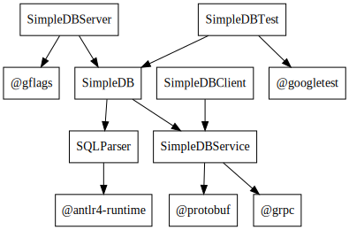

# SimpleDB

清华大学计算机系《数据库系统概论》2022 年大作业项目 DBMS，支持基础 SQL 的解析和执行。

所有支持的功能（即支持的 SQL）见[文法文件](SQLParser/Sql.g4)。

<div>


</div>

## 架构

本项目为 C/S 架构，由 C++ 服务器负责 SQL 的解析和执行，Python 客户端负责处理用户输入，二者之间通过 [gRPC](https://grpc.io) 进行网络传输。

各个部分分别为：

- `SimpleDB`（依赖库）：DBMS，负责数据库管理、SQL 的解析和执行
- `SQLParser`（依赖库）：解析 SQL 并生成 AST
- `SimpleDBService`（依赖库）：gRPC 库，用于支持网络传输
- `SimpleDBServer`（二进制程序）：服务器，通过 `SimpleDB` 处理客户端请求并返回结果
- `SimpleDBClient`（二进制程序）：客户端，处理用户请求，向服务器发送 SQL 语句，并显示返回的结果
- `SimpleDBTest`（单元测试）：对 `SimpleDB` 进行测试

各个部分及其使用的第三方库的依赖关系如下：



## 编译与运行

> macOS 13.0 和 Ubuntu 22.04 测试编译通过，其余环境未测试。

### 环境配置

使用 [Bazel](https://bazel.build) 和 clang 编译。

**对于 macOS**：

安装 Xcode command line tools：

```
xcode-select --install
```

安装 Bazel：

```
brew install bazel
```

**对于 Ubuntu**：

安装 Bazel 6.0.0：

```
sudo apt install apt-transport-https curl gnupg -y
curl -fsSL https://bazel.build/bazel-release.pub.gpg | gpg --dearmor >bazel-archive-keyring.gpg
sudo mv bazel-archive-keyring.gpg /usr/share/keyrings
echo "deb [arch=amd64 signed-by=/usr/share/keyrings/bazel-archive-keyring.gpg] https://storage.googleapis.com/bazel-apt stable jdk1.8" | sudo tee /etc/apt/sources.list.d/bazel.list
sudo apt update && sudo apt install bazel-6.0.0
```

安装 clang 和 lld：

```
sudo apt install clang lld
```

### 运行

运行服务器：

```
bazel run -- :simpledb_server --dir=<data_directory> [--debug | --verbose] [--addr=<listening_address>]
```

运行交互式客户端：

```
bazel run -- :simpledb_client --server=<addr>
```

从 CSV 中导入数据：

```
bazel run -- :simpledb_client --server=<addr> --csv=<csv_file> --db=<db_name> --table=<table_name>
```

运行单元测试：

```
bazel test :test_all
```

编译所有 target：

```
bazel build //...
```

编译结束后，运行此命令以生成 `compile_commands.json`：

```
bazel run @hedron_compile_commands//:refresh_all
```

## 具体实现

与具体实现有关的设计，见 [docs/design.md](docs/design.md)。
